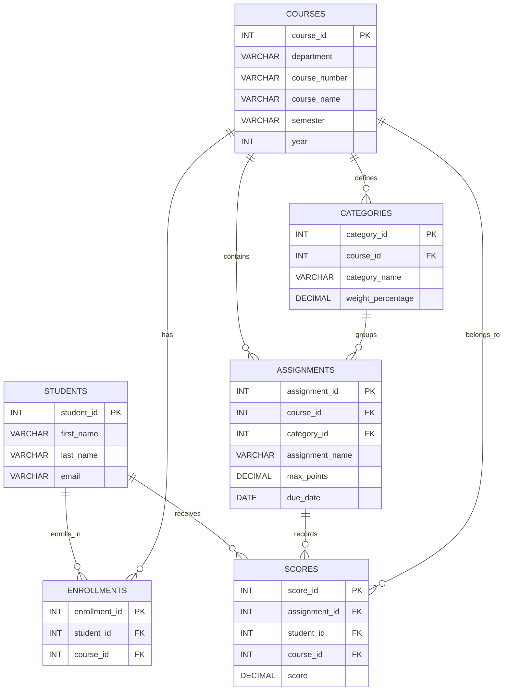

# ER Diagram

## Mermaid Diagram

## Primary Keys and Foreign Keys

- `students.student_id` is the primary key.
- `courses.course_id` is the primary key.
- `enrollments.enrollment_id` is the primary key.
- `enrollments.student_id` references `students.student_id`.
- `enrollments.course_id` references `courses.course_id`.
- `enrollments(student_id, course_id)` is unique so one student cannot be enrolled twice in the same course.
- `categories.category_id` is the primary key.
- `categories.course_id` references `courses.course_id`.
- `categories(course_id, category_name)` is unique so a category name cannot repeat within one course.
- `assignments.assignment_id` is the primary key.
- `assignments.course_id` references `courses.course_id`.
- `assignments(course_id, category_id)` references `categories(course_id, category_id)` so an assignment can only use a category from its own course.
- `scores.score_id` is the primary key.
- `scores(assignment_id, course_id)` references `assignments(assignment_id, course_id)`.
- `scores(student_id, course_id)` references `enrollments(student_id, course_id)`.

## Relationship Notes

### Why `assignments` includes both `course_id` and `category_id`

This is intentional rather than redundant. A category already belongs to a course, but storing `course_id` directly in `assignments` lets the schema enforce that the assignment and category belong to the same course. It also makes course-scoped assignment queries and uniqueness rules straightforward.

### Why `scores` includes `course_id`

Including `course_id` in `scores` strengthens integrity. It allows the schema to guarantee both of the following with foreign keys:

- the student must be enrolled in the course
- the assignment must belong to that same course

That prevents invalid gradebook rows such as a student receiving a score in a course they are not enrolled in.

### Weight enforcement

The ERD shows `weight_percentage` at the category level. In the actual schema, a trigger prevents category totals from exceeding `100`, and the stored procedure `assert_course_weights_total_100` validates that a course totals exactly `100` before grading-related operations are run.
